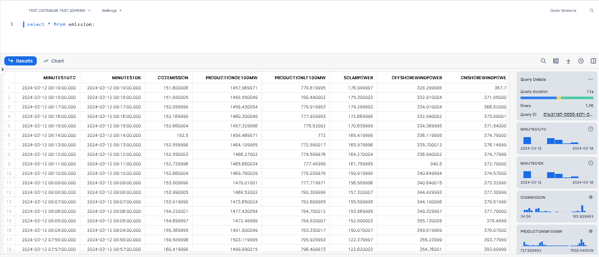
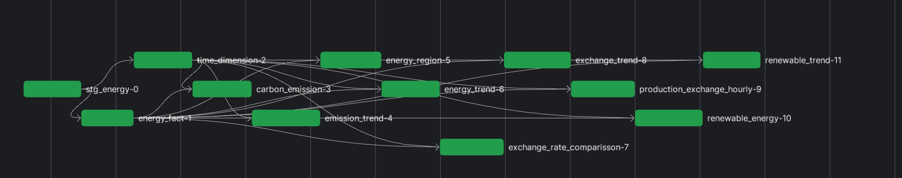
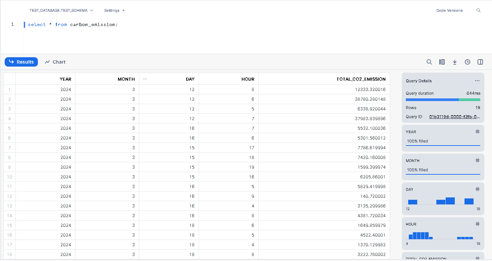
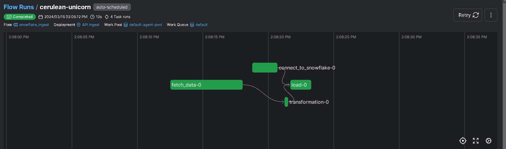

# Snowflake ETL and dbt Workflow Orchestration

This project demonstrates an end-to-end ETL pipeline from an API source to Snowflake database using Prefect for workflow orchestration. Additionally, it includes dbt (data build tool) for managing transformations.

## Project Structure

The project is organized as follows:

- **dbt_packages**: Contains dbt models and transformations.
- **dbt_transformation**: Holds dbt models and transformation scripts.
- **flows**: Contains Prefect workflow orchestration scripts.
- **yaml files**: Deployment plans, including a sample Prefect deployment YAML file.
- **requirements.txt**: Lists project dependencies.

## Prefect Workflow

The `snowflake_ingest` Prefect flow orchestrates the ETL process:

1. **fetch_data**: This task sends a request to an API endpoint (`https://api.energidataservice.dk/dataset/PowerSystemRightNow/`) using the `requests` library. It retrieves JSON-formatted data and returns the records.

2. **connect_to_snowflake**: This task establishes a connection to the Snowflake database using the `snowflake.connector` library. It retrieves the connection details (user, password, account, warehouse, database, schema) from environment variables, ensuring security and flexibility.

3. **transformation**: After fetching the data, this task transforms the JSON data into a pandas DataFrame (`df`). It then performs some data cleaning by dropping specific columns from the DataFrame.

4. **load**: Once the data is cleaned, this task loads it into the Snowflake database. It prepares an SQL insert statement (`snowflake_insert_sql`) and executes it using Snowflake's cursor. The data is inserted into the specified table (`emission`) in Snowflake.

5. **Main Function**: The script's main function (`energy_main`) orchestrates the ETL process by calling the above tasks in sequence. It fetches data, connects to Snowflake, performs transformation, loads data into Snowflake, and prints the cleaned DataFrame.

## Snowflake ETL Script (`snowflake_etl.py`)

The `snowflake_etl.py` script contains Python functions for ETL tasks:

- **fetch_data**: Fetches data from an API endpoint.
- **connect_to_snowflake**: Connects to Snowflake database using environment variables.
- **transformation**: Transforms JSON data into a pandas DataFrame.
- **load**: Loads cleaned data into Snowflake database.

## dbt Workflow

The `dbt_workflow.py` script orchestrates dbt transformations:

- It utilizes the `prefect_dbt_flow` library for integration with Prefect.
- Configures a dbt project and profile.
- Executes dbt transformations sequentially.

- DBT models materialized as *views* while the staging raw data materialized as a view

- Dbt models for the data

## Usage
1. Ensure necessary environment variables (Snowflake credentials) are set.
2. Install project dependencies listed in `requirements.txt`.
3. Run the Prefect flow `snowflake_ingest.py` for ETL.
4. Run the dbt workflow `dbt_workflow.py` for transformations.

## Deployment

Deployment plans can be found in YAML files within the project.

## Prefect workflow deployment

- The flow runs of the api_snowflake_ETL workflows looks like this:

 

- Building a data pipeline has its own different challenges:

## WorkFlow deployment Schedule

